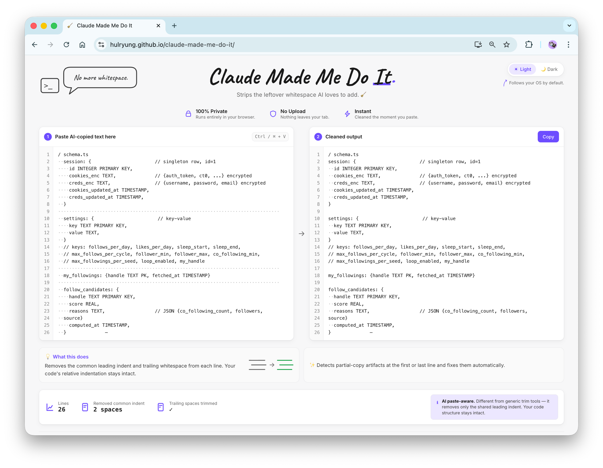

# 🧹 claude-made-me-do-it

> A web app I built because Claude Code's copy-paste keeps breaking my terminal.



[**Try it →** hulryung.github.io/claude-made-me-do-it](https://hulryung.github.io/claude-made-me-do-it/)

---

## The story

You ask Claude for a bash command. Claude gives you a bash command. You copy it. You paste it into your terminal. It breaks.

Why? Because every line came with a thoughtful little gift of leading spaces, and now your `for` loop is sad. You go to fix it. You select all. You hit Tab-one-too-many-times. You give up.

You think *"someone should make a website for this"*. **Reader, I made the website.**

## What it does

Paste anything that came out of Claude / ChatGPT / your favorite chat AI on the left. Get the same content on the right, minus the cosmetic damage:

- Common leading indent (the "every line has 2 spaces in front" problem) — **gone**
- Trailing whitespace — **also gone**
- Your actual code's relative indentation — **untouched**

It's like Python's `textwrap.dedent` and `rstrip` had a baby and gave it a website.

## What it does *not* do

- ❌ Upload your text anywhere. Everything happens in your browser. The Network tab will be very disappointed in you.
- ❌ Reformat your code. Not a linter. Not Prettier. Not in the opinions business.
- ❌ `trim()` each line independently — that would nuke your indentation. We're better than that.

## The smart bit

If the **first or last line** has zero leading whitespace while **every other line** has some, it's excluded from the common-prefix calculation. That's the "I started copying from the middle of a sentence" case. We assume you didn't mean it.

The full algorithm, for the curious:

1. Normalize line endings, split into lines.
2. Strip trailing whitespace from each line.
3. Find the longest common leading-whitespace prefix among non-empty lines (with the partial-copy carve-out above).
4. Strip that prefix from every line.
5. Trim leading/trailing blank lines.

That's it. ~100 lines of vanilla JS. Open [`clean.js`](clean.js) if you don't believe me.

## Usage

Three options, ranked by laziness:

1. **Use the deployed site.** [hulryung.github.io/claude-made-me-do-it](https://hulryung.github.io/claude-made-me-do-it/) — that's literally the whole product.
2. **Install it as an app.** It's a PWA, so most browsers offer "Install app" or "Add to Home Screen". Works offline. Adds a 🧹 to your dock.
3. **Run locally.** Clone this repo. Open `index.html`. Done.
   ```sh
   open index.html        # macOS
   xdg-open index.html    # Linux
   ```
   No build step. No dependencies. The only external thing is a Google Fonts link for the handwritten title — because vibes matter.

## Tests

Open [`tests.html`](tests.html) in a browser. 19 assertions verify the algorithm. They all pass. If they don't, please file an issue in capital letters.

## Tech stack

- HTML
- CSS
- JavaScript

That's the stack. Specifically: vanilla JS, inline `<style>`, single-page static, Service Worker for offline. Built mostly because the author was annoyed.

## Deploy

GitHub Pages, served from the root of the repo:

```
Settings → Pages → Source: main / (root)
```

The included `.nojekyll` file is there so GitHub Pages doesn't try to be clever with Jekyll. It's not a Jekyll site. Please don't get clever, GitHub.

## Credits

- Made with ☕ and frustration.
- Powered by the rage of one too many broken `for` loops.
- Brought to you by Claude — who, in fairness, did help write this.
